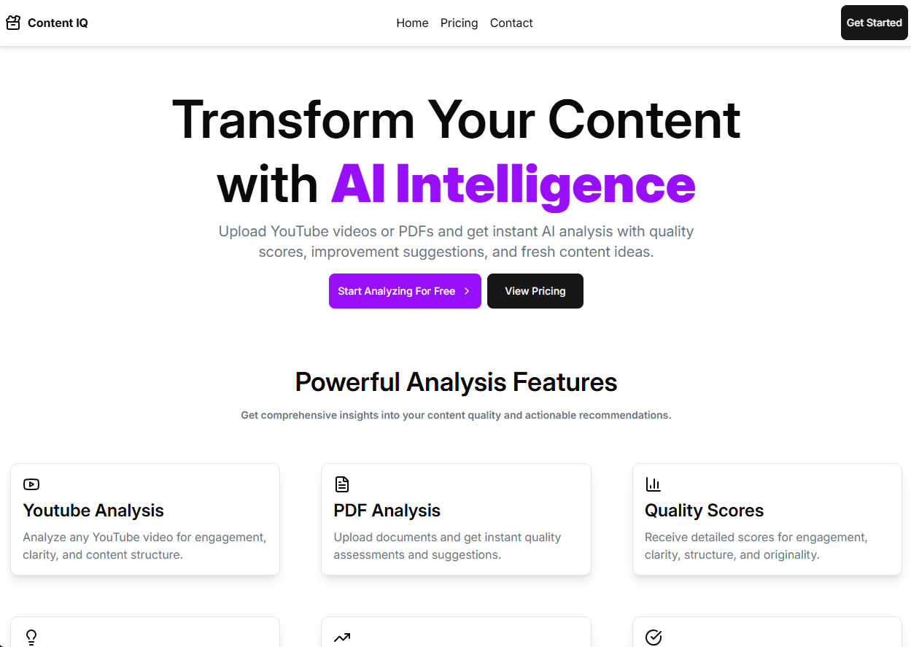

<p align="center">
  
</p>

<h1 align="center">Content Analysis Tool</h1>

<p align="center">
  A modern web application for analyzing YouTube videos, PDFs, resumes, and images.<br />
  Built with <b>React + Vite</b>, <b>TypeScript</b>, <b>Puter.js</b>, <b>shadcn/ui</b>, and <b>Zustand</b>.
</p>

---

## ✨ Features

- **Multi-format analysis**: YouTube videos, PDFs, resumes, images  
- **Comprehensive scoring**: Quality, readability, engagement metrics  
- **Actionable improvements**: Specific recommendations and suggestions  
- **Real-time processing**: Fast, interactive analysis feedback  
- **Responsive UI**: Built with shadcn/ui and Tailwind CSS  
- **Type-safe**: End-to-end TypeScript  
- **State management**: Lightweight global state with Zustand  

---

## 🛠️ Tech Stack

| Category   | Technology                          |
|-----------|--------------------------------------|
| Frontend  | React 18, Vite, TypeScript           |
| Runtime   | Bun / Puter.js                       |
| UI        | shadcn/ui, Tailwind CSS             |
| State     | Zustand                              |
| Analysis  | Custom ML models, NLP / LLM APIs     |

---

## 🚀 Quick Start

### Prerequisites

- Node.js 18+ or Bun  
- npm / Yarn / Bun (any one)

### Installation

```bash
# Clone the repository
git clone <your-repo-url>
cd content-analysis-tool

# Install dependencies
bun install
# or
npm install
# or
yarn install

# Run development server
bun dev
# or
npm run dev
# or
yarn dev
```
The app will be available at:
http://localhost:5173

📁 Project Structure
src/
├── components/     # shadcn/ui components + custom UI
├── lib/            # Utils, API clients, analysis logic
├── stores/         # Zustand state management
├── types/          # TypeScript definitions
├── hooks/          # Custom React hooks
└── app/            # Main app entry & pages

🎯 Usage
Upload content: Drag & drop or paste a YouTube URL / upload PDF / image / resume.

Run analysis: The AI pipeline processes the content (typically 2–10 seconds).

View results: See score breakdown, insights, and detailed suggestions.

Export: Download a PDF/JSON report of the analysis.

Example Analysis Output
📊 Resume Score: 82/100
✅ Strengths: Strong technical skills, relevant experience
⚠️ Improvements:
  - Add quantifiable achievements
  - Improve formatting consistency
  - Include GitHub / portfolio links

🧪 Testing
# Run tests
bun test
# or
npm run test
# or
yarn test

🚀 Deployment
# Build for production
bun run build
# or
npm run build
# or
yarn build

# Preview production build
bun run preview
# or
npm run preview
# or
yarn preview

📊 Analysis Features
| Content Type | Metrics Analyzed              | Score Categories                 |
| ------------ | ----------------------------- | -------------------------------- |
| YouTube      | Engagement, SEO, retention    | Watch time, CTR, content quality |
| PDFs         | Readability, structure        | Clarity, formatting              |
| Resumes      | ATS score, impact, relevance  | Experience, skills, keywords     |
| Images       | Quality, composition, context | Clarity, relevance               |

🤝 Contributing
Fork the repository
